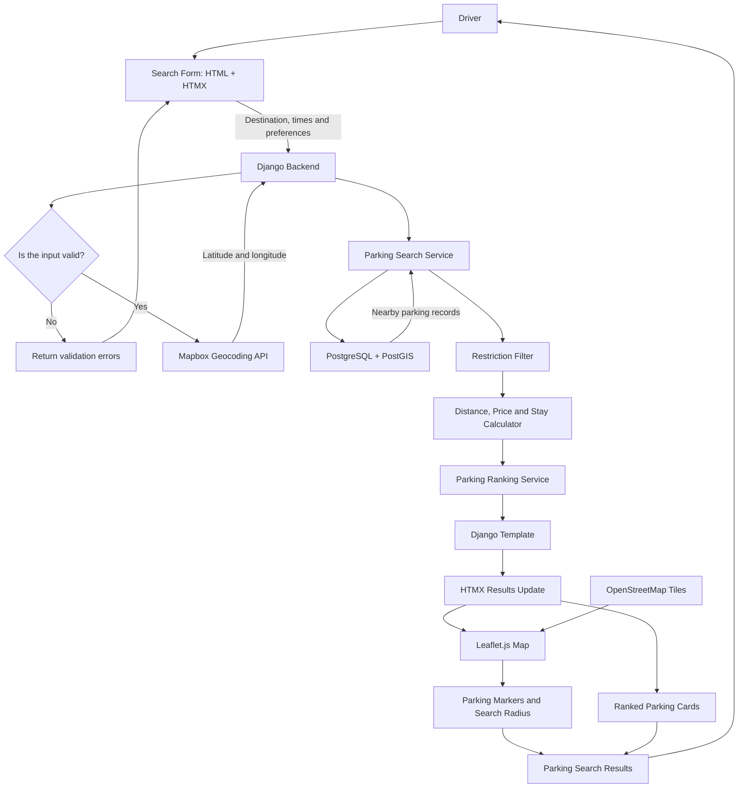
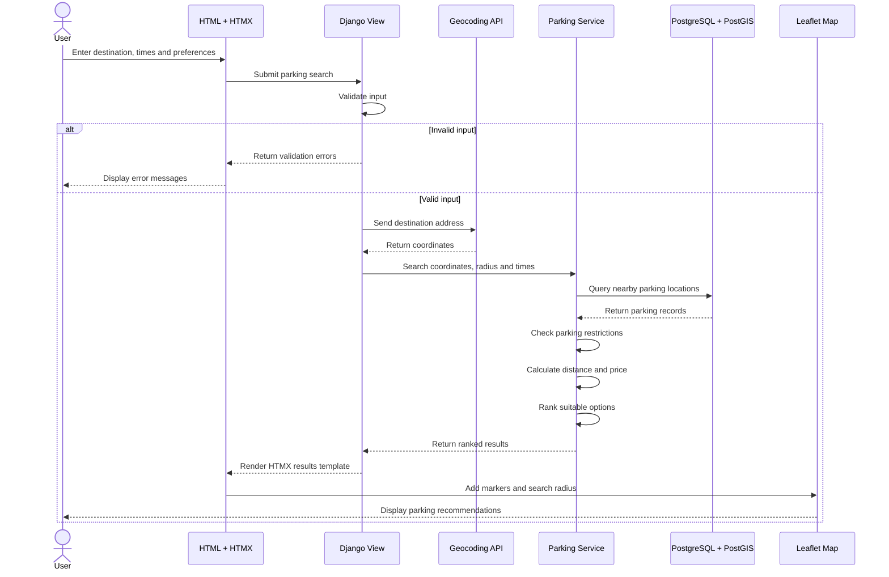

<div align="center">

# 🚗 Bris Parker

### Smarter parking choices for Brisbane


**A hackathon application that helps drivers find suitable parking based on walking distance, price and maximum stay.**

</div>

---

## Table of Contents

- [Project Overview](#project-overview)
- [The Problem](#the-problem)
- [Key Features](#key-features)
- [User Story](#user-story)
- [Tech Stack](#tech-stack)
- [System Architecture](#system-architecture)
- [Sequence Diagram](#sequence-diagram)
- [Ranking Strategy](#ranking-strategy)
- [Project Structure](#project-structure)
- [Getting Started](#getting-started)
- [Hackathon MVP](#hackathon-mvp)
- [Future Improvements](#future-improvements)
- [Authors](#authors)
- [Disclaimer](#disclaimer)

---

## Project Overview

**Bris Parker** is a web application designed to help drivers find suitable parking near their destination in Brisbane.

Users enter their destination, arrival time, departure time and preferred walking distance. The application searches parking data, checks the applicable restrictions and recommends suitable parking options on an interactive map.

This project was developed for the **Innovation That Helps Hackathon**.

## The Problem

Finding parking in Brisbane can be confusing and time-consuming. Parking prices, operating hours, maximum-stay limits and other restrictions are often spread across different signs and services.

Bris Parker brings this information together and presents suitable parking options in one place, allowing drivers to make a better decision before beginning their journey.

## Key Features

- Search for parking by address or destination
- Select arrival and departure times
- Set a preferred walking distance or search radius
- View nearby parking locations on an interactive map
- Compare price, walking distance and maximum stay
- Rank results by **Best Choice**, **Least Walking** or **Lowest Cost**
- Display relevant parking restrictions and sign information
- Update search results dynamically using HTMX

## User Story

> As a driver, I want to find parking near my destination based on walking distance, price and maximum stay, so that I can quickly choose the most suitable parking option.

### Acceptance Criteria

- [ ] The user can enter a valid destination.
- [ ] The user can enter an arrival and departure time.
- [ ] The user can select a walking distance or search radius.
- [ ] The system converts the destination into geographic coordinates.
- [ ] The system returns valid parking spots within the selected radius.
- [ ] Each result displays its price, walking distance and maximum stay.
- [ ] Suggested parking locations appear on an interactive map.
- [ ] The user can rank or filter the returned parking options.

## Tech Stack

| Layer | Technology | Responsibility |
|---|---|---|
| Backend | Python and Django | Validation, request handling and business logic |
| Frontend | HTML, CSS, JavaScript and HTMX | User interface and dynamic page updates |
| Database | PostgreSQL and PostGIS | Parking records and geographic queries |
| Map library | Leaflet.js | Interactive map, markers, popups and search radius |
| Map tiles | OpenStreetMap | Base map and street information |
| Geocoding | Mapbox Geocoding API | Converts addresses into latitude and longitude |
| Open data | Brisbane City Council datasets | Parking signs, locations and restrictions |
| Version control | Git and GitHub | Team collaboration and source-code management |

## System Architecture

Bris Parker follows Django's **Model–Template–View architecture**.

Django manages the application workflow, PostGIS performs geographic searches, HTMX updates the results without reloading the entire page, and Leaflet displays the parking options on an OpenStreetMap map.



### Architecture Flow

1. The driver submits a destination, arrival time, departure time and parking preferences.
2. Django validates the submitted information.
3. Mapbox converts the destination address into latitude and longitude.
4. PostGIS finds parking locations within the selected radius.
5. The application removes parking options that do not satisfy the selected times or maximum stay.
6. The remaining options are scored based on distance, price and stay suitability.
7. Django returns the ranked results as an HTMX partial.
8. Leaflet displays the parking locations on an OpenStreetMap map.

## Sequence Diagram



## Ranking Strategy

Each valid parking option receives a suitability score.

```text
Suitability Score = Distance Score + Price Score + Stay Score
```

The weighting changes according to the user's selected preference.

| Preference | Ranking Behaviour |
|---|---|
| Best Choice | Balances distance, cost and maximum-stay suitability |
| Least Walking | Gives the greatest weight to walking distance |
| Lowest Cost | Prioritises free and lower-cost parking |

## Project Structure

```text
TheBrissyParkers/
├── manage.py
├── requirements.txt
├── .env.example
├── bris_parker/
│   ├── settings.py
│   ├── urls.py
│   └── wsgi.py
├── parking/
│   ├── migrations/
│   ├── services/
│   │   ├── geocoding.py
│   │   └── parking_search.py
│   ├── forms.py
│   ├── models.py
│   ├── urls.py
│   └── views.py
├── templates/
│   └── parking/
├── static/
│   ├── css/
│   └── js/
└── data/
```

## Getting Started

### Prerequisites

Make sure the following software is installed:

- Git
- Python 3.11 or later
- PostgreSQL
- PostGIS extension
- A Mapbox access token

### 1. Clone the Repository

```bash
git clone https://github.com/zaraho/TheBrissyParkers.git
cd TheBrissyParkers
```

### 2. Create a Virtual Environment

#### Windows PowerShell

```powershell
py -m venv .venv
.\.venv\Scripts\Activate.ps1
```

#### macOS or Linux

```bash
python3 -m venv .venv
source .venv/bin/activate
```

### 3. Install the Dependencies

```bash
pip install -r requirements.txt
```

### 4. Configure Environment Variables

Create a file named `.env` in the project root.

```env
SECRET_KEY=replace-with-a-local-secret
DEBUG=True

DB_NAME=bris_parker
DB_USER=postgres
DB_PASSWORD=your-password
DB_HOST=localhost
DB_PORT=5432

MAPBOX_ACCESS_TOKEN=your-mapbox-token
```


### 5. Enable PostGIS

Run the following SQL statement inside the project database:

```sql
CREATE EXTENSION IF NOT EXISTS postgis;
```

### 6. Apply the Database Migrations

```bash
python manage.py migrate
```

### 7. Import Parking Data

When the parking-data import command has been implemented, run:

```bash
python manage.py import_parking_data
```

### 8. Start the Application

```bash
python manage.py runserver
```

Open the following address in your browser:

```text
http://127.0.0.1:8000/
```

## Hackathon MVP

The minimum viable product includes:

- Destination and parking-preference search form
- Address geocoding
- Radius-based parking search
- Parking restriction filtering
- Three result-ranking modes
- Interactive parking map
- Parking markers and result cards
- Price, distance and maximum-stay information

## Future Improvements

- Real-time parking availability
- Accessible-parking filters
- EV charging and motorcycle-parking filters
- Live traffic and event information
- Walking directions from the parking location
- Saved destinations and recent searches
- Community reporting for outdated restrictions
- Predictive parking availability using historical demand

## Authors

Built for the **Innovation That Helps Hackathon** by:

| Team Member | Contribution |
|---|---|
| **Ila** | Django backend |
| **Rizwan** | HTMX and frontend |
| **Suha** | PostgreSQL and PostGIS |
| **Zara and Dhruthi ** | Mapping, geocoding and Brisbane City Council data |

